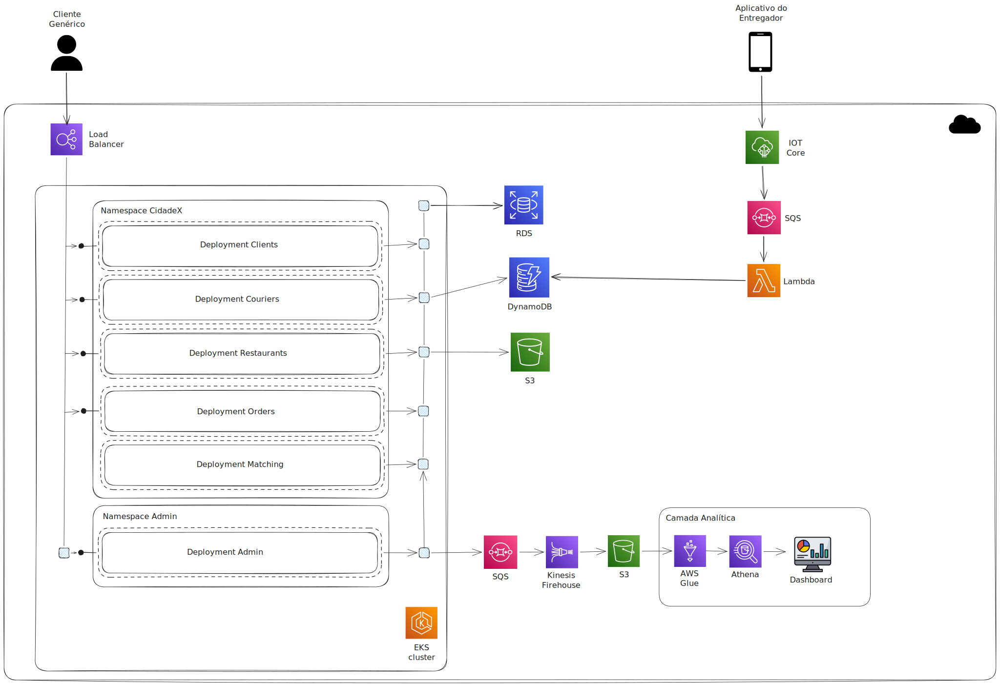

# Delivery System
Esse repositório traz uma infraestrutura kubernetes de um aplicativo de delivery idealizado para seguir a seguinte infraestrutura AWS



## Como rodar

### Rodando localmente

1. Builde as imagens Docker de todos os serviços:

```sh
docker build -t delivery-system/admin:latest ./admin
docker build -t delivery-system/clients:latest ./clients
docker build -t delivery-system/couriers:latest ./couriers
docker build -t delivery-system/matching:latest ./matching
docker build -t delivery-system/orders:latest ./orders
docker build -t delivery-system/restaurants:latest ./restaurants
```

2. Suba a infraestrutura local (postgres, localstack, dynamodb-admin e positions):

```sh
docker compose up -d
```

3. Crie a fila SQS dentro do localstack
```sh
docker exec -it localstack awslocal sqs create-queue --queue-name courier-locations
```

4. Garanta que o Kubernetes do Docker Desktop está habilitado e selecione o contexto:

```sh
kubectl config use-context docker-desktop
```

5. Instale o NGINX Ingress Controller:

```sh
kubectl apply -f https://raw.githubusercontent.com/kubernetes/ingress-nginx/main/deploy/static/provider/cloud/deploy.yaml

kubectl wait --namespace ingress-nginx --for=condition=ready pod --selector=app.kubernetes.io/component=controller --timeout=300s
```

> **Observação:** os manifests `service-local.yaml` utilizam recursos Ingress. Sem o NGINX Ingress Controller instalado, o Kubernetes retornará erros semelhantes a:
>
> ```txt
> failed calling webhook "validate.nginx.ingress.kubernetes.io"
> service "ingress-nginx-controller-admission" not found
> ```

6. Crie os namespaces:

```sh
kubectl apply -f infra/k8s/admin/namespace.yaml
kubectl apply -f infra/k8s/city/namespace-template.yaml
```

7. Aplique ConfigMaps e Secrets locais (host.docker.internal para Postgres/Localstack):

```sh
kubectl apply -f infra/k8s/config/local/admin-configmap.yaml
kubectl apply -f infra/k8s/config/local/admin-secret.yaml
kubectl apply -f infra/k8s/config/local/city-configmap.yaml
kubectl apply -f infra/k8s/config/local/city-secret.yaml
```

8. Suba os deployments e services:

```sh
kubectl apply -f infra/k8s/admin/admin.yaml
kubectl apply -f infra/k8s/city/clients.yaml
kubectl apply -f infra/k8s/city/couriers.yaml
kubectl apply -f infra/k8s/city/matching.yaml
kubectl apply -f infra/k8s/city/orders.yaml
kubectl apply -f infra/k8s/city/restaurants.yaml
kubectl apply -f infra/k8s/admin/service-local.yaml
kubectl apply -f infra/k8s/city/service-local.yaml
```

#### Portas locais (NodePort)

- admin: http://localhost:30040
- clients: http://localhost:30041
- couriers: http://localhost:30042
- orders: http://localhost:30044
- restaurants: http://localhost:30045

Obs: matching fica apenas como ClusterIP (sem NodePort).

### Atualizando o código localmente

Sempre que alterar o código de um serviço (rotas, lógica, conexão com banco, etc.), é necessário rebuildar a imagem Docker e restartar o deployment no Kubernetes. O Kubernetes não detecta mudanças no código automaticamente.

**Para um serviço específico:**

```sh
# Rebuilda a imagem
docker build -t delivery-system/<servico>:latest ./<servico>

# Restarta o deployment
kubectl rollout restart deployment/<servico> -n <namespace>

# Acompanha até ficar pronto (opcional)
kubectl rollout status deployment/<servico> -n <namespace>
```

Exemplos:

```sh
# Atualizando orders em uma cidade
docker build -t delivery-system/orders:latest ./orders
kubectl rollout restart deployment/orders -n city-sp-namespace
kubectl rollout status deployment/orders -n city-sp-namespace

# Atualizando admin
docker build -t delivery-system/admin:latest ./admin
kubectl rollout restart deployment/admin -n admin-namespace
kubectl rollout status deployment/admin -n admin-namespace
```

**Para o positions (consumer SQS), que roda no Docker Compose:**

```sh
docker compose up -d --build positions
```

**Para rebuildar e restartar todos os serviços de uma vez:**

```sh
docker build -t delivery-system/admin:latest ./admin
docker build -t delivery-system/clients:latest ./clients
docker build -t delivery-system/couriers:latest ./couriers
docker build -t delivery-system/matching:latest ./matching
docker build -t delivery-system/orders:latest ./orders
docker build -t delivery-system/restaurants:latest ./restaurants

kubectl rollout restart deployment -n admin-namespace
kubectl rollout restart deployment -n city-sp-namespace
```

### Rodando em producao (EKS)

1. Provisione a infraestrutura via Terraform:

```sh
cd infra/terraform/aws
terraform init
terraform apply -var-file=prod.tfvars
```

2. Configure o kubeconfig para o cluster EKS criado pelo Terraform:

```sh
aws eks update-kubeconfig --name <cluster_name> --region us-east-1
```

3. Preencha os valores de producao:
	- Atualize o endpoint RDS em `infra/k8s/config/prod/*-configmap.yaml`.
	- Preencha as credenciais em `infra/k8s/config/prod/*-secret.yaml` (estes arquivos sao ignorados pelo git).

4. Aplique namespaces, configs e deployments:

```sh
kubectl apply -f infra/k8s/admin/namespace.yaml
kubectl apply -f infra/k8s/city/namespace-template.yaml

kubectl apply -f infra/k8s/config/prod/admin-configmap.yaml
kubectl apply -f infra/k8s/config/prod/admin-secret.yaml
kubectl apply -f infra/k8s/config/prod/city-configmap.yaml
kubectl apply -f infra/k8s/config/prod/city-secret.yaml

kubectl apply -f infra/k8s/admin/admin.yaml
kubectl apply -f infra/k8s/city/clients.yaml
kubectl apply -f infra/k8s/city/couriers.yaml
kubectl apply -f infra/k8s/city/matching.yaml
kubectl apply -f infra/k8s/city/orders.yaml
kubectl apply -f infra/k8s/city/restaurants.yaml
kubectl apply -f infra/k8s/admin/service-prod.yaml
kubectl apply -f infra/k8s/city/service-prod.yaml
```

### Verificacao rapida

```sh
kubectl get pods -n admin-namespace
kubectl get pods -n city-example-namespace
kubectl describe configmap app-config -n admin-namespace
kubectl describe secret app-secret -n admin-namespace
```

### Remover tudo (cleanup)

#### Local (Docker Desktop)

1. Remova os recursos do Kubernetes:

```sh
kubectl delete -f infra/k8s/admin/admin.yaml
kubectl delete -f infra/k8s/city/clients.yaml
kubectl delete -f infra/k8s/city/couriers.yaml
kubectl delete -f infra/k8s/city/matching.yaml
kubectl delete -f infra/k8s/city/orders.yaml
kubectl delete -f infra/k8s/city/restaurants.yaml
kubectl delete -f infra/k8s/admin/service-local.yaml
kubectl delete -f infra/k8s/city/service-local.yaml

kubectl delete -f infra/k8s/config/local/admin-configmap.yaml
kubectl delete -f infra/k8s/config/local/admin-secret.yaml
kubectl delete -f infra/k8s/config/local/city-configmap.yaml
kubectl delete -f infra/k8s/config/local/city-secret.yaml

kubectl delete -f infra/k8s/admin/namespace.yaml
kubectl delete -f infra/k8s/city/namespace-template.yaml
```

2. Remova o NGINX Ingress Controller:

```sh
kubectl delete -f https://raw.githubusercontent.com/kubernetes/ingress-nginx/main/deploy/static/provider/cloud/deploy.yaml
```

3. Pare e remova containers e volumes locais:

```sh
docker compose down -v
```

#### Producao (EKS)

1. Remova os recursos do Kubernetes:

```sh
kubectl delete -f infra/k8s/admin/admin.yaml
kubectl delete -f infra/k8s/city/clients.yaml
kubectl delete -f infra/k8s/city/couriers.yaml
kubectl delete -f infra/k8s/city/matching.yaml
kubectl delete -f infra/k8s/city/orders.yaml
kubectl delete -f infra/k8s/city/restaurants.yaml
kubectl delete -f infra/k8s/admin/service-prod.yaml
kubectl delete -f infra/k8s/city/service-prod.yaml

kubectl delete -f infra/k8s/config/prod/admin-configmap.yaml
kubectl delete -f infra/k8s/config/prod/admin-secret.yaml
kubectl delete -f infra/k8s/config/prod/city-configmap.yaml
kubectl delete -f infra/k8s/config/prod/city-secret.yaml

kubectl delete -f infra/k8s/admin/namespace.yaml
kubectl delete -f infra/k8s/city/namespace-template.yaml
```

2. Destrua a infraestrutura com Terraform:

```sh
cd infra/terraform/aws
terraform destroy -var-file=prod.tfvars
```